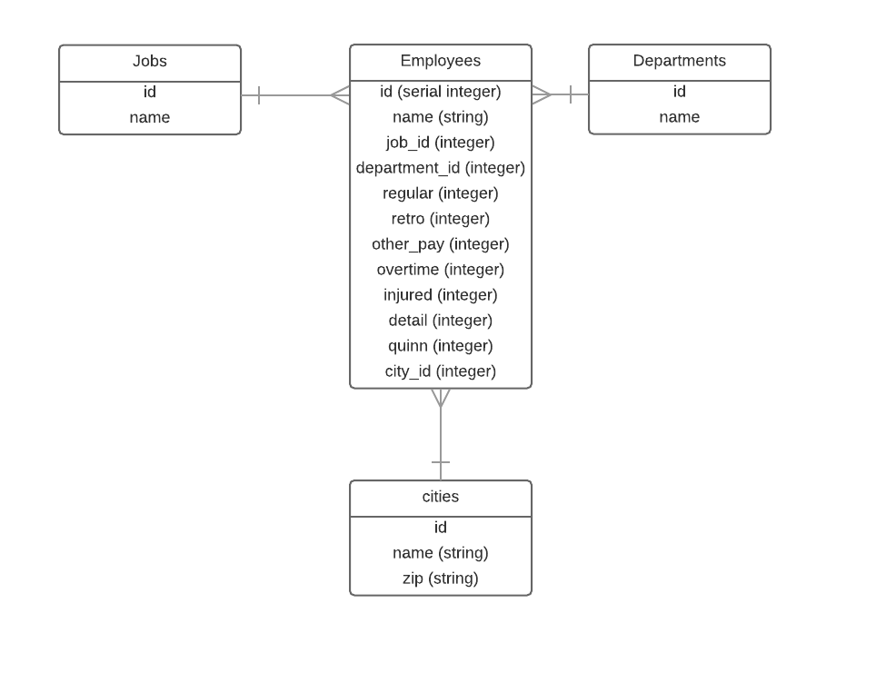

# Boston City Employee Salary Data API
[](https://codeship.com/projects/126788)
[](https://coveralls.io/github/nickcluc/boston_employees?branch=master)

This application parses through an available resource on the web [https://data.cityofboston.gov/Finance/Employee-Earnings-Report-2014/4swk-wcg8] and given a job title,
will return specific information including **average salary**, **maximum salary**, **minimum salary**, and a **list of employees** with that job title.

## Quick Set Up

- Clone the repo ```git clone https://github.com/nickcluc/boston_employees.git```
- Run ```bundle install```
- Run ```rake db:migrate```
- Run ```rake employee_data:import```
- Run ```rails server```
- Navigate your browser to ```locahost:3000```
- If you want a specific job title, navigate to ```locahost:3000?job_name=admin asst```

## OR If You Want To Skip Right To The Good Stuff
[https://glacial-forest-2757.herokuapp.com/?job_name=admin%20asst]

##### Try a few different job titles:
- Asst Corp Counsel Iii
- Admin Asst
- Prin Clerk

## Models


## How It Works
A rake task was created to parse through a JSON version of the Boston Employees Earnings Report. This task an be set up via a cron job to run periodically and repopulate, update and create new records as they are added to the report. This method (parse and store on a local DB) was chosen so that in case the resource was ever taken offline, the API could still function with the data in the DB.

This employee data is then serialized to include the appropriate values (average, min, max salaries) and job information (name, list of employees, etc.) to be able to build upon the desired requirements going forward.

# API
There is only one call, a ```GET``` to the jobs resource. This resource accepts a ```job_name``` param. If there is no ```job_name``` param, the first 10 jobs in the database are returned. If the no job is found from the ```job_name``` param, the JSON returns an error message.
